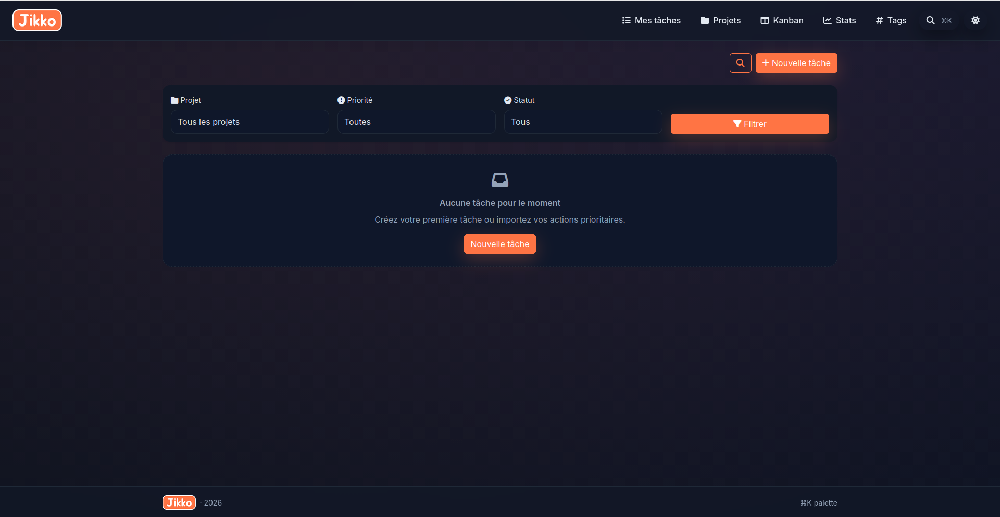
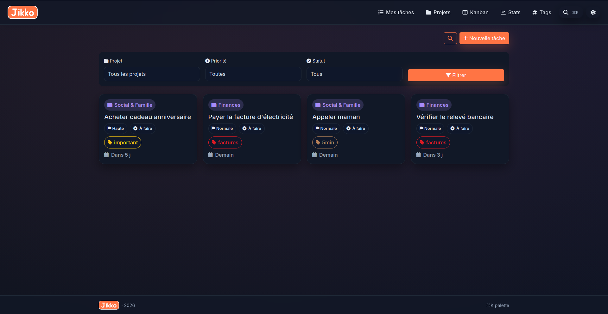
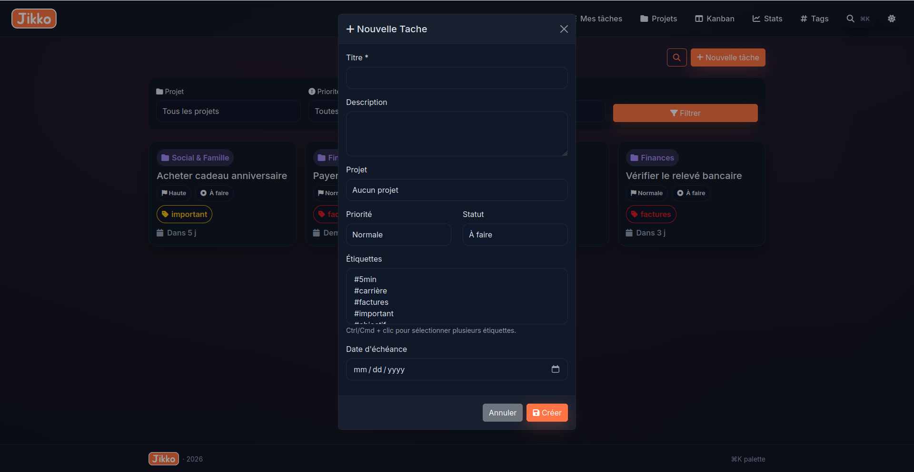
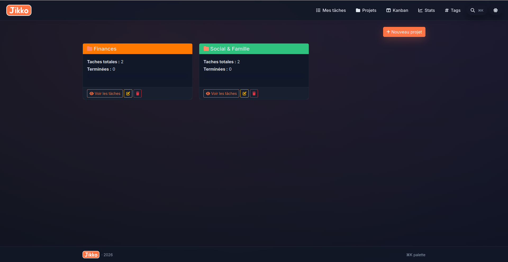
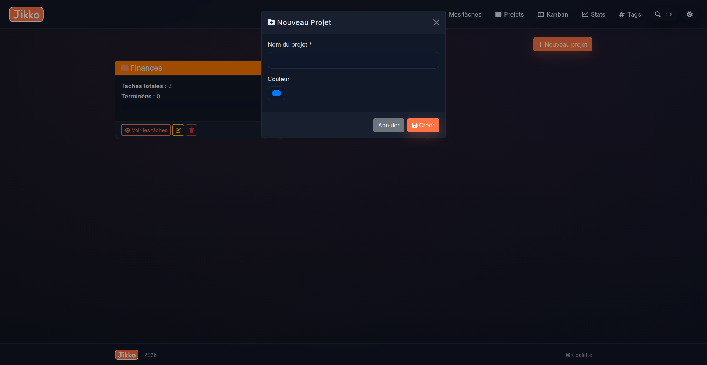
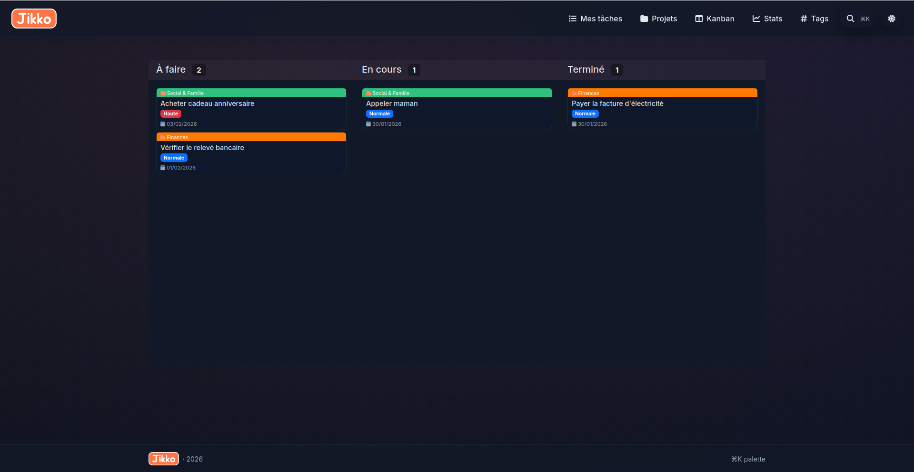
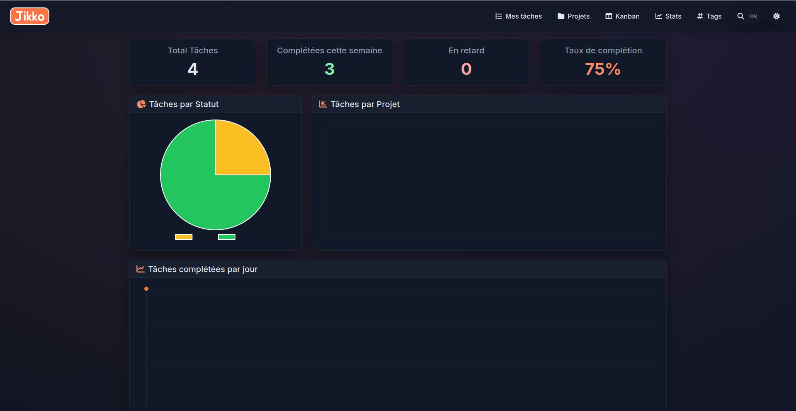
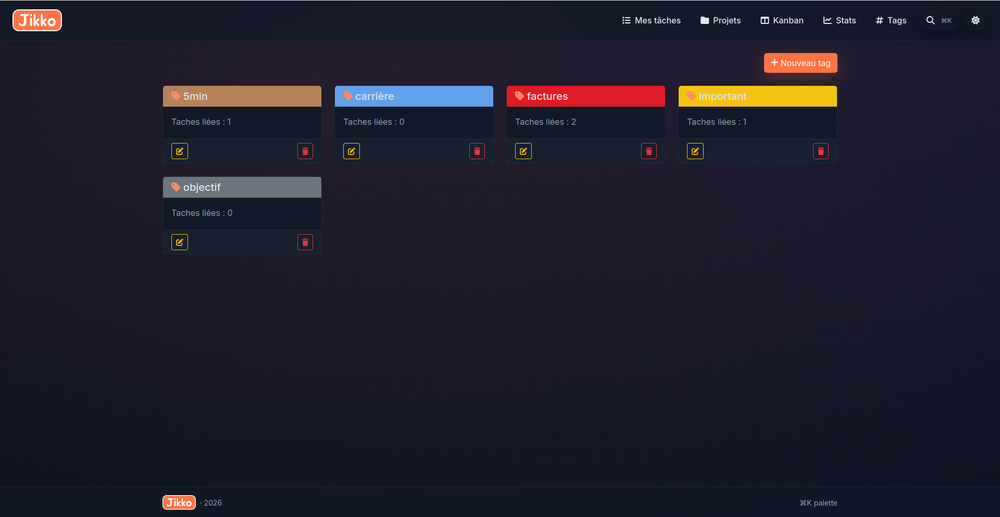
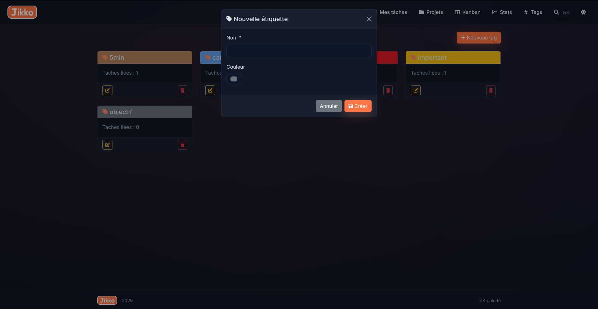

# Todo List Application

A modern, feature-rich task management application built with PHP and Bootstrap. Manage your tasks, organize them into projects, track progress with statistics, and use tags for better organization.



## About the Name: Jikko (実行)

The application is named **Jikko**, which carries deep meaning in Japanese:

In Japanese, **jikkō (実行)** means **"execution"** or **"implementation."** It refers to carrying out, executing, or putting something into practice. This perfectly captures the essence of our application—transforming your ideas and plans into actual accomplishments.

The word is composed of two kanji characters:

- **実 (jitsu)** - real, actual, truth
- **行 (kō)** - to go, to carry out, action (action in French)

Just as jikko represents the act of execution and putting plans into action, this application empowers you to organize, track, and execute your tasks effectively.

## Table of Contents

- [Features](#features)
- [Requirements](#requirements)
- [Installation](#installation)
- [Project Structure](#project-structure)
- [Features Overview](#features-overview)
  - [My Tasks](#my-tasks)
  - [Projects](#projects)
  - [Kanban Board](#kanban-board)
  - [Statistics](#statistics)
  - [Tags](#tags)
- [Database Schema](#database-schema)
- [Configuration](#configuration)
- [Usage](#usage)

## Features

✨ **Task Management**

- Create, edit, and delete tasks with ease
- Set task priority (Low, Normal, High)
- Track task status (To Do, In Progress, Completed)
- Set due dates for tasks
- Assign tasks to specific projects

📁 **Project Organization**

- Group tasks into projects
- Customize project colors
- View all tasks within a project

🏷️ **Tag System**

- Create and manage custom tags
- Assign multiple tags to tasks
- Color-coded tags for better visibility
- Filter tasks by tags

📊 **Analytics & Insights**

- View comprehensive statistics
- Track completed vs. pending tasks
- Monitor task distribution by priority
- Visualize project progress

🎯 **Kanban Board**

- Drag-and-drop task management
- Visual organization by status
- Quick status updates

## Requirements

- PHP 7.4 or higher
- MySQL 5.7 or higher
- Web server (Apache, Nginx, etc.)
- Bootstrap 5.x
- Modern web browser

## Installation

### Step 1: Clone or Download the Project

```bash
cd /path/to/your/webroot
git clone https://github.com/yourusername/todolist.git
cd todolist
```

### Step 2: Create Database and User

Connect to MySQL and run the following commands:

```sql
-- Create the database
CREATE DATABASE IF NOT EXISTS todo_list;

-- Create a dedicated user
CREATE USER 'todolist_user'@'localhost' IDENTIFIED BY 'todolist_pass';

-- Grant privileges
GRANT ALL PRIVILEGES ON todo_list.* TO 'todolist_user'@'localhost';
FLUSH PRIVILEGES;
```

### Step 3: Import Database Schema

Import the database schema:

```bash
mysql -u todolist_user -p todo_list < database_setup.sql
```

Or import it manually through phpMyAdmin by selecting the `database_setup.sql` file.

### Step 4: Configure Database Connection

Edit `config/database.php` and update the credentials if needed:

```php
define('DB_HOST', 'localhost');
define('DB_NAME', 'todo_list');
define('DB_USER', 'todolist_user');
define('DB_PASS', 'todolist_pass');
```

### Step 5: Start Your Server

For local development using PHP's built-in server:

```bash
php -S localhost:8000
```

Then open your browser and navigate to:

```
http://localhost:8000
```

## Project Structure

```
todolist/
├── index.php                 # Main dashboard page
├── kanban.php               # Kanban board view
├── projects.php             # Projects management
├── tags.php                 # Tags management
├── stats.php                # Statistics page
│
├── ajax/                    # AJAX endpoints
│   ├── tasks.php           # Task operations
│   ├── projects.php        # Project operations
│   ├── tags.php            # Tag operations
│   └── stats.php           # Statistics data
│
├── config/                  # Configuration files
│   ├── database.php        # Database connection
│   ├── init.php            # Initialization
│   └── session.php         # Session management
│
├── includes/               # Reusable components
│   ├── header.php          # Header component
│   ├── footer.php          # Footer component
│   ├── classes/            # PHP classes
│   └── modals/             # Bootstrap modals
│       ├── task_modals.php
│       ├── project_modals.php
│       └── tag_modals.php
│
├── js/                     # JavaScript files
│   ├── app.js              # Main application logic
│   ├── tasks.js            # Task management
│   └── tags.js             # Tag management
│
├── css/                    # Stylesheets
│   └── style.css           # Custom styles
│
├── images/                 # Image assets
│   ├── jikko-logo.png
│   └── screenshots/        # Feature screenshots
│
├── cron/                   # Scheduled tasks (if any)
│
├── database_setup.sql      # Database schema
└── README.md              # This file
```

## Features Overview

### My Tasks

The dashboard where you can see all your tasks at a glance. Create new tasks, edit existing ones, and manage your daily to-do list.


**Features:**

- View all tasks in a clean, organized list
- Filter tasks by project, priority, or status
- See task details and due dates
- Quick access to edit and delete tasks



**Creating a Task:**

Click the "New Task" button to open the task creation modal. Fill in:

- **Title** (required) - Task name
- **Description** - Detailed description
- **Project** - Assign to a project (optional)
- **Priority** - Low, Normal, or High
- **Status** - To Do, In Progress, or Completed
- **Tags** - Assign multiple tags
- **Due Date** - Task deadline



**Task Actions:**

- ✏️ **Edit** - Modify task details
- ✓ **Complete** - Mark as done
- 🗑️ **Delete** - Remove task (with confirmation)

---

### Projects

Organize your tasks into projects. Each project can have its own color for easy visual identification.



**Features:**

- Create new projects with custom colors
- View all tasks in a project
- Edit project details
- Delete projects (tasks will be unassigned)
- Quick statistics for each project

**Creating a Project:**

Click "New Project" to open the project creation modal:

- **Name** - Project name (required)
- **Color** - Pick a color for visual identification
- Click "Create" to add the project



**Managing Projects:**

- View all tasks within a project
- Edit project name and color
- Delete a project
- Filter tasks by project on the dashboard

---

### Kanban Board

Visualize your workflow with an interactive Kanban board. Organize tasks by status and drag-and-drop to update them.



**Columns:**

- 📋 **To Do** - Tasks yet to be started
- 🔄 **In Progress** - Currently working on
- ✅ **Completed** - Finished tasks

**Features:**

- Drag tasks between columns to change status
- Click on a task to view/edit details
- Quick access to task information
- Real-time status updates

---

### Statistics

Track your productivity with comprehensive analytics and insights.



**Metrics Displayed:**

- **Total Tasks** - Count of all tasks
- **Completed Tasks** - Number of finished tasks
- **Completion Rate** - Percentage of completed tasks
- **Tasks by Priority** - Distribution across priority levels
- **Tasks by Status** - Breakdown by current status
- **Overdue Tasks** - Tasks past their due date
- **Project Overview** - Stats for each project
- **Task Trends** - Visual charts and graphs

---

### Tags

Create custom tags to categorize and organize your tasks more effectively.



**Features:**

- Create custom tags with unique colors
- Assign tags to multiple tasks
- Filter tasks by tags
- Edit tag names and colors
- Delete tags (tags removed from associated tasks)

**Creating a Tag:**

Click "New Tag" to add a tag:

- **Name** - Tag name (required)
- **Color** - Choose a color for the tag
- Click "Create" to add the tag



**Using Tags:**

- Assign multiple tags to each task
- Filter dashboard by tags
- Color-coded tags for quick identification
- Search and manage tags easily

---

## Database Schema

The application uses a relational database with the following structure:

### Tables

**projets (Projects)**

```sql
CREATE TABLE projets (
    id INT PRIMARY KEY AUTO_INCREMENT,
    nom VARCHAR(200) NOT NULL,
    couleur VARCHAR(7) DEFAULT '#007bff'
);
```

**taches (Tasks)**

```sql
CREATE TABLE taches (
    id INT PRIMARY KEY AUTO_INCREMENT,
    projet_id INT,
    titre VARCHAR(300) NOT NULL,
    description TEXT,
    priorite ENUM('basse', 'normale', 'haute') DEFAULT 'normale',
    statut ENUM('a_faire', 'en_cours', 'termine') DEFAULT 'a_faire',
    date_echeance DATE,
    ordre INT DEFAULT 0,
    date_creation TIMESTAMP DEFAULT CURRENT_TIMESTAMP,
    FOREIGN KEY (projet_id) REFERENCES projets(id) ON DELETE CASCADE
);
```

**etiquettes (Tags)**

```sql
CREATE TABLE etiquettes (
    id INT PRIMARY KEY AUTO_INCREMENT,
    nom VARCHAR(50) NOT NULL,
    couleur VARCHAR(7) DEFAULT '#6c757d'
);
```

**taches_etiquettes (Task-Tag Junction)**

```sql
CREATE TABLE taches_etiquettes (
    tache_id INT,
    etiquette_id INT,
    PRIMARY KEY (tache_id, etiquette_id),
    FOREIGN KEY (tache_id) REFERENCES taches(id) ON DELETE CASCADE,
    FOREIGN KEY (etiquette_id) REFERENCES etiquettes(id) ON DELETE CASCADE
);
```

## Configuration

### Database Configuration

Located in `config/database.php`:

```php
define('DB_HOST', 'localhost');    // Database host
define('DB_NAME', 'todo_list');    // Database name
define('DB_USER', 'todolist_user'); // Database user
define('DB_PASS', 'todolist_pass'); // Database password
```

### Session Configuration

Sessions are managed in `config/session.php` to maintain user state across requests.

## API Endpoints

### Tasks

- `POST ajax/tasks.php?action=create` - Create a new task
- `POST ajax/tasks.php?action=update` - Update a task
- `POST ajax/tasks.php?action=delete` - Delete a task

### Projects

- `POST ajax/projects.php?action=create` - Create a new project
- `POST ajax/projects.php?action=update` - Update a project
- `POST ajax/projects.php?action=delete` - Delete a project

### Tags

- `POST ajax/tags.php?action=create` - Create a new tag
- `POST ajax/tags.php?action=update` - Update a tag
- `POST ajax/tags.php?action=delete` - Delete a tag

### Statistics

- `GET ajax/stats.php` - Get application statistics

## Troubleshooting

### Database Connection Error

**Problem:** "Erreur de connexion"

**Solution:**

1. Verify MySQL is running
2. Check database credentials in `config/database.php`
3. Ensure the database and user were created correctly
4. Test connection: `mysql -u todolist_user -p todo_list`

### No Tasks/Projects Appearing

**Problem:** Dashboard appears empty

**Solution:**

1. Check if database tables exist: `SHOW TABLES;`
2. Verify data was inserted: `SELECT * FROM taches;`
3. Clear browser cache (Ctrl+Shift+Del)
4. Check browser console for JavaScript errors (F12)

### Tasks Not Saving

**Problem:** Creating/editing tasks doesn't work

**Solution:**

1. Check browser console for errors (F12)
2. Verify AJAX endpoints are accessible
3. Check file permissions on `ajax/` directory
4. Ensure all required fields are filled in forms

### Styling Issues

**Problem:** Page layout looks broken

**Solution:**

1. Verify Bootstrap CSS is loaded (check Network tab in F12)
2. Clear browser cache
3. Check if `css/style.css` is accessible
4. Ensure all image paths are correct

## Support & Contributing

For issues, suggestions, or contributions, please:

1. Check the troubleshooting section above
2. Review the code comments
3. Test in multiple browsers
4. Provide detailed error messages when reporting issues

## License

This project is open source and available under the MIT License.

```
MIT License

Copyright (c) 2026 Jikko Todo List

Permission is hereby granted, free of charge, to any person obtaining a copy
of this software and associated documentation files (the "Software"), to deal
in the Software without restriction, including without limitation the rights
to use, copy, modify, merge, publish, distribute, sublicense, and/or sell
copies of the Software, and to permit persons to whom the Software is
furnished to do so, subject to the following conditions:

The above copyright notice and this permission notice shall be included in all
copies or substantial portions of the Software.

THE SOFTWARE IS PROVIDED "AS IS", WITHOUT WARRANTY OF ANY KIND, EXPRESS OR
IMPLIED, INCLUDING BUT NOT LIMITED TO THE WARRANTIES OF MERCHANTABILITY,
FITNESS FOR A PARTICULAR PURPOSE AND NONINFRINGEMENT. IN NO EVENT SHALL THE
AUTHORS OR COPYRIGHT HOLDERS BE LIABLE FOR ANY CLAIM, DAMAGES OR OTHER
LIABILITY, WHETHER IN AN ACTION OF CONTRACT, TORT OR OTHERWISE, ARISING FROM,
OUT OF OR IN CONNECTION WITH THE SOFTWARE OR THE USE OR OTHER DEALINGS IN THE
SOFTWARE.
```

---

Version: 1.0.0  
Last Updated: January 2026
